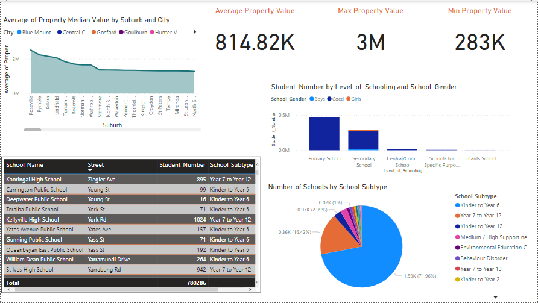
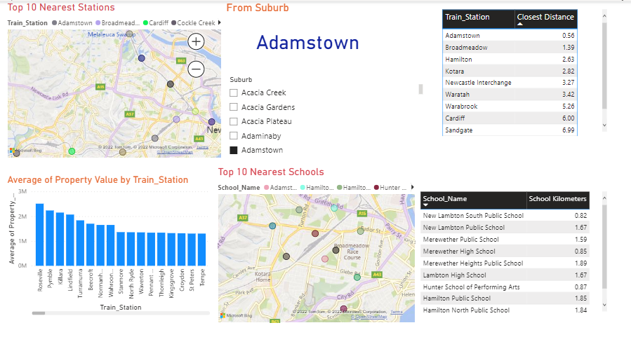

# PropertyAnalysis
## Introduction

This is an end to end data analysis project of New South Wales properties. This projects helps to analyze and derive property values of different 
suburbs and cities as per the related factos like schools,public transports etc. This project will also cover beautiful data visualization which
will help people to make data driven decisions.

## Datasets

The Datasets was included Australia Suburbs details, Property Values, Schools, Public transports. 
The datasets were cleaned and standardised using excel and  power query editor.

## Data Modelling

Here we have created the star schema modelling using Kimball Methodology. 
We have created Propety Value as fact table which is surrounded by other dimensional tables.

## Data Visualization

------

------

-------
The above dashboard contains covers the maximum,minimum and average value pf the property as per the suburb entered. This also gives the detailed 
idea of the top 10 near by schools and public transports as well as the distance from the property.

## Conclusion

The property value is highly dependent on the availabilty of the schools and public transports near them. This visualization will give a clear idea
about the schools and public transport details as well as the propert values before considering to buy them.

